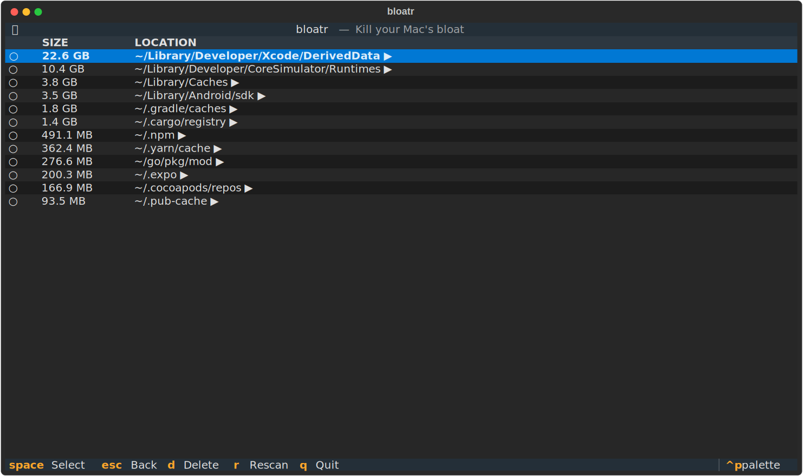

<div align="center">

# bloatr

**Kill your Mac's bloat. Select. Delete. Done.**

[](https://pypi.org/project/bloatr/)
[](https://pypi.org/project/bloatr/)
[](LICENSE)
[](https://github.com/suhasdinesh/bloatr)

A macOS CLI for developers who've run out of disk space one too many times.  
Finds your biggest caches and build artifacts, lets you explore and delete them safely — with a live progress bar.

<!-- Replace with demo.gif once recorded -->


</div>

---

## Install

```bash
pipx install bloatr
```

<details>
<summary>Or with pip</summary>

```bash
pip install bloatr
```

</details>

---

## Usage

```bash
# Launch interactive TUI — scans known developer bloat locations
bloatr

# Scan any directory, like `du` but interactive
bloatr ~/
bloatr ~/Library/Caches
bloatr ~/Documents

# Safe preview — see what would be deleted without touching anything
bloatr --dry-run

# Only show items larger than a threshold
bloatr --min-size 1G

# JSON output — pipe-friendly
bloatr --json
bloatr --json | jq '.[].size_human'
```

---

## How it works

1. **Scan** — bloatr measures your biggest developer cache directories in parallel
2. **Explore** — drill into any folder with `Enter` to see what's inside
3. **Select** — press `Space` on items you want to delete
4. **Delete** — press `D`, confirm, and watch a live progress bar as space is freed

---

## What it scans

| Location | What it is |
|---|---|
| `~/Library/Developer/Xcode/DerivedData` | Xcode build artifacts |
| `~/Library/Developer/Xcode/Archives` | Xcode app archives |
| `~/Library/Developer/CoreSimulator/Runtimes` | iOS/watchOS simulator runtimes |
| `~/Library/Developer/Xcode/iOS DeviceSupport` | Per-device debug symbols |
| `~/Library/Caches` | App caches |
| `~/.gradle/caches` | Gradle build cache |
| `~/.npm` | npm package cache |
| `~/.yarn/cache` | Yarn package cache |
| `~/.pnpm-store` | pnpm content-addressable store |
| `~/.cocoapods/repos` | CocoaPods spec repos |
| `~/.cargo/registry` | Rust crate registry |
| `~/.cargo/git` | Rust git dependencies |
| `~/.pub-cache` | Flutter/Dart package cache |
| `~/go/pkg/mod` | Go module cache |
| `~/.expo` | Expo/React Native cache |
| `~/Library/Android/sdk` | Android SDK |
| `~/Library/Application Support/JetBrains` | JetBrains IDE caches |
| Homebrew cache | `brew --cache` output |

> **Tip:** Don't see a location you care about? Run `bloatr ~/` to scan your entire home directory.

---

## Keyboard shortcuts

| Key | Action |
|---|---|
| `j` / `↓` | Move down |
| `k` / `↑` | Move up |
| `space` | Toggle select |
| `enter` | Drill into folder |
| `esc` / `backspace` | Go back |
| `d` | Delete selected items |
| `r` | Rescan from scratch |
| `q` | Quit |

---

## Safety

bloatr will **never** delete:

- Anything outside your home directory (`~`)
- Top-level protected directories — `~/Library`, `~/Documents`, `~/Desktop`, `~/Pictures`, `~/Downloads`, and more
- Anything *inside* those personal directories (Documents, Desktop, Downloads, etc.)
- The home directory itself

Every deletion requires an **explicit confirmation prompt**. Use `--dry-run` to simulate a cleanup run without touching the filesystem.

---

## Credits

Idea and direction by a developer who lost 100 GB to Xcode caches one afternoon.  
Code written entirely by [Claude Code](https://claude.ai/code).

---

## License

MIT
